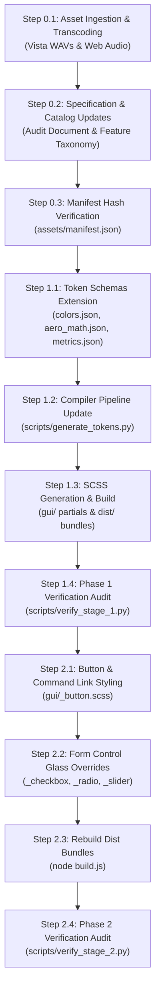

# Windows Vista Theming Extension: Specification & Execution Plan (Phases 0-2)

This document establishes the architecture, asset ingestion methodology, design token extensions, and component implementation roadmap for adding authentic Windows Vista theming to `7.css`.

---

## 1. Architectural Strategy & Design Principles

Windows Vista introduced the Windows Aero design language (DWM composition, translucent glass, text glow halos, Command Links, and vector-rendered controls) that Windows 7 subsequently refined. Integrating Windows Vista as a selectable theme option provides access to Vista's iconic aesthetics (notably the signature charcoal-black Aero glass, 8 canonical personalization tints, solid opaque black maximized windows, and glossy split-horizon push buttons) while sharing the zero-dependency, token-driven architecture of `7.css`.

### 1.1 Technical Differentiation Matrix

The following table summarizes the primary visual and behavioral differences between Windows 7 SP1 and Windows Vista RTM/SP2:

| Dimension | Windows 7 Aero (Current Baseline) | Windows Vista Aero (Theme Extension) |
| :--- | :--- | :--- |
| **Default Glass Tint** | Sky Blue (`#70a4c2`, `rgba(112, 164, 194, 0.65)`) | Charcoal / Black (`#000000`, `rgba(0, 0, 0, 0.65)`) |
| **Personalization Palette** | 16 discrete tints (pastel & saturated spectrum) | 8 canonical tints (Windows Aero, Teal, Red, Yellow, Green, Orange, Pink, Frost) |
| **Maximized Window Frames** | Retains translucent glass and Aero blur | Opaque solid black (`#000000` / `#0a0a0a`) with no glass blur |
| **Inactive Window Frames** | Muted, desaturated grayish-blue glass | Translucent slate gray (`rgba(160, 175, 190, 0.45)`) |
| **Glass Specular Pattern** | Diagonal ambient specular reflection highlight | Horizontal gloss band combined with diagonal reflection streaks |
| **Text Halo Glow** | Soft white multi-stop halo (`drop-shadow` blur radius 3px) | Dense, high-luminance white halo configured for dark glass contrast |
| **Caption Button Geometry** | Flat rectangular buttons flush with top frame margin | Rounded inset glassy pills with distinct cyan/red radial glows |
| **Push Button Styling** | Subtle linear gradient with cyan border pulse | Glossy gel pill with pronounced split-horizon top highlight and aqua glow |
| **Basic Theme Fallback** | Light powder blue opaque gradient (`#99b4d1` to `#b9d1ea`) | Deep cyan-slate opaque gradient (`#4c6b8c` to `#2f4865`) |
| **Progress Bar Styling** | Segmented gel blocks with translating shimmer | Smooth continuous gel cylinder with animated Aurora liquid wave |

### 1.2 CSS Selector Architecture & Scoping

The Vista theme is activated via HTML data attributes, allowing application-wide or per-window theme selection:

1. **Root or Container Level:**
   - `<html data-theme="vista">` or `<body data-theme="vista">`: Applies Vista styling across the entire DOM tree.
   - `<div class="window" data-theme="vista">`: Scopes Vista styling to a specific window instance.
2. **Aero Personalization Tints:**
   - `[data-theme="vista"][data-aero-tint="..."]`: Applies one of the 8 Vista canonical tints.
   - Defaults to the signature Vista charcoal-black tint when no tint attribute is provided.
3. **Maximized Window State:**
   - `.window.maximized[data-theme="vista"]`: Enforces solid black window borders and titlebar background without transparency or backdrop filters.
4. **Basic Theme Fallback:**
   - `[data-theme="vista-basic"]`: Applies the non-composited Windows Vista Basic theme.

---

## 2. Phase 0: Resource Gathering, Ingestion & Specification Audit

Phase 0 acquires authentic reference assets, audits historical metrics, and updates documentation schemas while maintaining strict isolation from the host Windows 11 environment.

### 2.1 Asset Provenance & Target Directory Layout

| Asset Category | Target Directory | Primary Source Repository | Extraction / Transcoding Pipeline | Target Deliverable |
| :--- | :--- | :--- | :--- | :--- |
| **System Audio Masters** | `scratch/reference/vista_wav/` | `MCPlayer2015/all-windows-sounds`<br>(Branch: `master`, Dir: `(2006) Windows Vista`) | Downloaded via `curl.exe` directly from GitHub raw blob storage. Uncompressed 16-bit 44.1kHz PCM WAV masters. | 16 master WAV files preserved in local uncommitted reference tier. |
| **Web-Optimized Audio** | `assets/audio/vista/` | Transcoded from `scratch/reference/vista_wav/` | Transcoded using `ffmpeg.exe` (libmp3lame 64k mono; libopus 32k mono). All files verified under 12KB. | 32 files (16 `.mp3`, 16 `.webm`). |
| **Vista MSStyles Bitmaps** | `assets/extracted/vista_msstyles/` | Windows Vista RTM `aero.msstyles` | Ingested via uncommitted reference extraction for 9-slice reference. | Reference PNG strips (split-horizon button, caption buttons, glass noise). Excluded from git. |
| **System Cursors** | `assets/extracted/cursors_vista/` | `bartekl1/windows-ui-assets`<br>(Branch: `main`, Dir: `Cursors/Windows Vista`) | Official `.cur` and `.ani` binaries (standard arrow, spinning aqua donut busy cursor). | 15 cursor files. Excluded from git via `.gitignore`. |
| **Micro-Glyph Vectors** | `assets/processed/svg/vista/` | Hand-authored SVG vector paths | Clean SVGs for Vista caption button icons, Command Link arrow, and checkbox/radio glyphs. | 6 scalable vector files tracked in git. |
| **Design Tokens** | `assets/tokens/` | Reverse-engineered registry parameters and MSDN specifications | Extended JSON schemas covering Vista color palettes, glass physics, and metrics. | Updated canonical JSON schemas. |

### 2.2 Audio Scheme Inventory (Windows Vista)

The following master audio files will be ingested and transcoded into `assets/audio/vista/`:

1. `Windows Startup.wav`
2. `Windows Logoff.wav`
3. `Windows Logon.wav`
4. `Windows Navigation Start.wav`
5. `Windows Balloon.wav`
6. `Windows User Account Control.wav`
7. `Windows Critical Stop.wav`
8. `Windows Error.wav`
9. `Windows Exclamation.wav`
10. `Windows Ding.wav`
11. `Windows Information Bar.wav`
12. `Windows Feed Discovered.wav`
13. `Windows Print complete.wav`
14. `Windows Minimize.wav`
15. `Windows Restore.wav`
16. `Windows Hardware Insert.wav`

### 2.3 Legal Hygiene & Two-Tier Segregation

Strict adherence to legal isolation guidelines is maintained:
- **Tier 1 (Excluded from Git):** `scratch/reference/vista_wav/`, `assets/extracted/vista_msstyles/`, `assets/extracted/cursors_vista/`.
- **Tier 2 (Tracked Deliverables):** `assets/audio/vista/*.mp3`, `assets/audio/vista/*.webm`, `assets/tokens/*.json`, `assets/processed/svg/vista/*.svg`.

---

## 3. Phase 1: Token Architecture & Color Engine Extensions

Phase 1 integrates Vista color stops, glass shaders, and metrics into the token compiler pipeline.

### 3.1 Token Schema Extensions (`assets/tokens/`)

#### 1. `colors.json` Extensions
- **`vistaAeroGlass` Dictionary:**
  - `default` / `graphite` / `black`: `rgba(0, 0, 0, 0.65)` (Hex: `#000000`, RGB: `0, 0, 0`)
  - `teal`: `rgba(46, 111, 126, 0.65)` (Hex: `#2e6f7e`, RGB: `46, 111, 126`)
  - `red`: `rgba(139, 29, 29, 0.65)` (Hex: `#8b1d1d`, RGB: `139, 29, 29`)
  - `yellow`: `rgba(158, 129, 30, 0.65)` (Hex: `#9e811e`, RGB: `158, 129, 30`)
  - `green`: `rgba(39, 106, 38, 0.65)` (Hex: `#276a26`, RGB: `39, 106, 38`)
  - `orange`: `rgba(154, 78, 30, 0.65)` (Hex: `#9a4e1e`, RGB: `154, 78, 30`)
  - `pink`: `rgba(137, 45, 99, 0.65)` (Hex: `#892d63`, RGB: `137, 45, 99`)
  - `frost`: `rgba(205, 216, 224, 0.70)` (Hex: `#cdd8e0`, RGB: `205, 216, 224`)
- **`vistaBasic` Dictionary:**
  - `titleBarActive`:
    - `gradient`: `linear-gradient(to bottom, #4c6b8c 0%, #364f6b 50%, #2b3f56 51%, #354e6a 100%)`
    - `border`: `1px solid #23374d`
    - `textColor`: `#ffffff`
  - `titleBarInactive`:
    - `gradient`: `linear-gradient(to bottom, #748a9e 0%, #5d7488 50%, #50667a 51%, #5b7185 100%)`
    - `border`: `1px solid #4a5c6d`
    - `textColor`: `#d0d7de`
  - `frameBorder`: `4px solid #364f6b`
- **`vistaControls` Dictionary:**
  - Button normal, hover, pressed, and pulse gradients incorporating Vista's high-contrast split-horizon gloss.
  - Progress bar "Aurora" stream gradient stops.

#### 2. `aero_math.json` Extensions
- **Vista Glass Shader Parameters:**
  - `backdropFilter`: `blur(18px) saturate(200%) brightness(85%)`
  - `inactiveBackdropFilter`: `blur(12px) saturate(110%) brightness(95%)`
  - `maximizedBackground`: `#000000`
  - `specularReflectionsVista`:
    - Horizontal gloss bar: `linear-gradient(to bottom, rgba(255, 255, 255, 0.5) 0%, rgba(255, 255, 255, 0.15) 45%, rgba(0, 0, 0, 0.15) 50%, rgba(0, 0, 0, 0.0) 100%)`
    - Specular glare slash: `linear-gradient(115deg, rgba(255, 255, 255, 0.5) 0%, rgba(255, 255, 255, 0.0) 40%)`
  - `textHaloGlowVista`: `drop-shadow(0 0 2px #ffffff) drop-shadow(0 0 4px #ffffff) drop-shadow(0 0 8px rgba(255, 255, 255, 0.8))`

#### 3. `metrics.json` Extensions
- Vista titlebar height: restored `30px`, maximized `26px`.
- Vista caption button dimensions: width `43px`, height `19px`.

### 3.2 Token Compiler Updates (`scripts/generate_tokens.py`)

The compiler script will be updated to emit Vista tokens while preserving existing Windows 7 outputs:
1. Emits `--w7-vista-*` token variables into `:root` in `gui/_tokens.scss`.
2. Generates `gui/_vista-tints.scss` (or embeds into `gui/_aero-tints.scss`) providing selector bindings:
   ```scss
   [data-theme="vista"],
   .window[data-theme="vista"] {
     --w7-aero-tint-color: rgba(0, 0, 0, 0.65);
     --w7-aero-tint-rgb: 0, 0, 0;
     --w7-w-bg: rgba(0, 0, 0, 0.65);
     --w7-glass-specular-reflection: var(--w7-vista-glass-specular-reflection);
     --w7-glass-text-halo-active: var(--w7-vista-text-halo);
     /* 8 Vista tints mapped via [data-theme="vista"][data-aero-tint="..."] */
   }

   /* Maximized Vista Window - Opaque Solid Black Frame */
   [data-theme="vista"].maximized,
   .window.maximized[data-theme="vista"],
   [data-theme="vista"] .window.maximized {
     --w7-glass-blur: none;
     --w7-w-bg: #000000;
     --w7-w-grad: #000000;
     --w7-w-bd: #000000;
     background: #000000;
   }

   /* Windows Vista Basic */
   [data-theme="vista-basic"],
   .window[data-theme="vista-basic"] {
     --w7-glass-blur: none;
     --w7-w-bg: #4c6b8c;
     --w7-w-grad: linear-gradient(to bottom, #4c6b8c 0%, #364f6b 50%, #2b3f56 51%, #354e6a 100%);
     --w7-w-bd: #23374d;
   }
   ```
3. Updates `gui/_variables.scss` to import the new partials.
4. Executes build via `node build.js` to regenerate `dist/7.css`, `dist/7.scoped.css`, and `dist/7.inline.css`.

### 3.3 Phase 1 Verification Suite (`scripts/verify_stage_1.py`)

Expands `verify_stage_1.py` with the following automated assertions:
- `colors.json` contains `vistaAeroGlass` with all 8 tints.
- `colors.json` contains `vistaBasic` active and inactive gradients.
- `_tokens.scss` declares Vista-specific CSS custom properties.
- `_aero-tints.scss` binds `[data-theme="vista"]` and all 8 tints.
- `_aero-tints.scss` binds `[data-theme="vista"].maximized` solid black rules.
- `_aero-tints.scss` binds `[data-theme="vista-basic"]` fallback rules.
- Clean compilation of all distribution bundles with zero PostCSS errors.

---

## 4. Phase 2: Form Controls & Command Primitives (Vista Adaptations)

Phase 2 introduces Vista-specific visual adaptations to form controls without breaking default Windows 7 styling.

### 4.1 Component Adaptation Specifications

1. **Push Buttons (`gui/_button.scss`):**
   - Under `[data-theme="vista"] button`:
     - Applies the glossy split-horizon gradient stops.
     - Top half: `#ffffff` fading to `#e5e5e5` at 50%.
     - Bottom half: `#dcdcdc` to `#c8c8c8` at 100%.
     - Hover state: Bright aqua glow (`box-shadow: 0 0 5px rgba(0, 160, 240, 0.7)`).
     - Default pulse animation: Cyan pulsing glow (`@keyframes w7-vista-button-pulse`).
2. **Command Links (`gui/_button.scss`):**
   - Under `[data-theme="vista"] .command-link`:
     - Primary instruction text: Segoe UI 12pt with Vista link blue (`#003399`).
     - Vista green circular glyph integration.
     - Inset focus outline on keyboard focus.
3. **Progress Bars (`gui/_progressbar.scss`):**
   - Under `[data-theme="vista"] progress`:
     - Continuous green gel cylinder styling.
     - Animated light beam / liquid highlight pass.
4. **Checkboxes & Radio Buttons (`gui/_checkbox.scss`, `gui/_radiobutton.scss`):**
   - Under `[data-theme="vista"]`:
     - Hover state applies soft aqua glow fill.
     - Dark navy checkmark glyph (`#1c385c`).
5. **Sliders / Trackbars (`gui/_slider.scss`):**
   - Under `[data-theme="vista"] input[type="range"]`:
     - Metallic rounded thumb with blue center highlight.

### 4.2 Phase 2 Verification Suite (`scripts/verify_stage_2.py`)

Expands `verify_stage_2.py` to assert:
- `_button.scss` contains `[data-theme="vista"]` button gradient and pulse overrides.
- `_button.scss` binds Vista command link styling.
- `_progressbar.scss` supports Vista Aurora styling.
- Distribution bundles export all Vista control rules.

---

## 5. Sequential Execution Sequence

The execution workflow is broken into deterministic steps across the three phases:



### Detailed Steps

1. **Step 0.1:** Ingest authentic uncompressed Windows Vista master WAVs from `MCPlayer2015/all-windows-sounds` into `scratch/reference/vista_wav/`, transcode to `assets/audio/vista/*.mp3` and `*.webm` via `ffmpeg.exe`.
2. **Step 0.2:** Update `docs/research/windows-7-ui-specification-audit.md` and `docs/research/windows-7-ui-feature-catalog.md` with Windows Vista specifications.
3. **Step 0.3:** Update `assets/manifest.json` with SHA-256 hashes of all newly created distributable assets.
4. **Step 1.1:** Extend `assets/tokens/colors.json`, `assets/tokens/metrics.json`, and `assets/tokens/aero_math.json` with Vista tokens.
5. **Step 1.2:** Update `scripts/generate_tokens.py` to compile Vista token rules and tint selectors.
6. **Step 1.3:** Compile SCSS partials and build distribution bundles via `node build.js`.
7. **Step 1.4:** Execute `scripts/verify_stage_1.py` with expanded Vista checkpoints.
8. **Step 2.1:** Implement Vista button styling, split-horizon gloss, and pulse keyframes in `gui/_button.scss`.
9. **Step 2.2:** Implement Vista checkboxes, radio buttons, and slider styling in `gui/` partials.
10. **Step 2.3:** Recompile distribution bundles via `node build.js`.
11. **Step 2.4:** Execute `scripts/verify_stage_2.py` and `scripts/check_repo_safety.py`.
