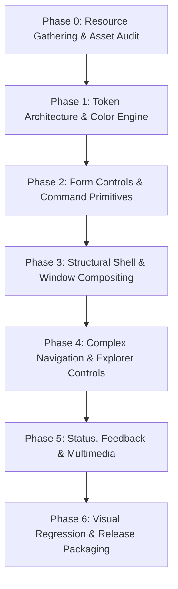

# Windows 7 UI (7.css) Restoration: Master Roadmap & Technical Specification Audit

This document defines the high-level master restoration roadmap and the exhaustive technical specification audit for rebuilding `7.css` to historical fidelity matching Windows 7 SP1 Aero.

---

## 1. Master Restoration Roadmap

The project is structured into seven sequential phases. Each phase establishes explicit preconditions and verified deliverables.



### Phase Breakdown

1. **Phase 0: Resource Gathering & Asset Audit (Current Phase)**
   - Extract raw bitmaps, sprite sheets, stream resources, dialog icons, and audio waveforms from native Windows 7 installation binaries.
   - Audit official MSDN Windows User Experience Interaction Guidelines for exact DLU and pixel metrics.
   - Construct the component state matrix and gap analysis against the existing `7.css` repository.
   - Establish the structured raw asset directory.

2. **Phase 1: Token Architecture & Color Engine**
   - Implement the complete CSS custom property token dictionary (`--w7-*`).
   - Define exact RGB/HSL color stop variables for standard Aero controls.
   - Implement the 16 standard Aero personalization tints via CSS data attributes (`[data-aero-tint="..."]`).
   - Establish baseline typography rules for Segoe UI with subpixel font smoothing.

3. **Phase 2: Form Controls & Command Primitives**
   - Rewrite push buttons with authentic 6-state multi-stop linear gradients and breathing pulse animation.
   - Implement Command Links (`.command-link`) with green circular glyphs, 12pt instruction headers, and 9pt secondary descriptions.
   - Rebuild checkboxes, radio buttons, text fields, group boxes, sliders, and spin buttons to eliminate XP remnants.

4. **Phase 3: Structural Shell & Window Compositing**
   - Implement authentic Aero Glass title bars utilizing `backdrop-filter: blur(20px)` and specular reflection highlight masks.
   - Implement GDI+ style text halos (`DrawThemeTextEx`) using multi-layered white glow drop-shadow filters.
   - Construct 4-state caption buttons (Minimize, Maximize, Restore, Close) with cyan and crimson radial back-glow shaders.
   - Build standard Task Dialog layouts with distinct 12pt primary instruction headers and `#f0f0f0` commit button footer bars.

5. **Phase 4: Complex Navigation & Explorer Controls**
   - Reconstruct TreeView controls using authentic triangular chevrons (`GLPS_CLOSED`, `GLPS_OPENED`) instead of classic `+` and `-` square glyphs.
   - Implement the Explorer Breadcrumb Bar with split-segment hover states and drop-down menu chevrons.
   - Build ListView column headers with sort direction indicators, row selection states, and marquee selection rectangles.
   - Build the Explorer Command Bar and Split Buttons.

6. **Phase 5: Status, Feedback & Multimedia**
   - Rebuild gel progress bars with the 50% sharp horizon specular gradient and translating pulse shimmer.
   - Support Normal (Green), Paused (Yellow), and Error (Red) progress states.
   - Construct standard Balloon notifications, ScreenTips, and Infobars.
   - Integrate Web Audio API helpers for native UI feedback sounds (`Windows Navigation Start.wav`, `Windows Balloon.wav`).

7. **Phase 6: Visual Regression & Release Packaging**
   - Execute pixel-difference comparison against Windows 7 SP1 native screenshots at 96 DPI.
   - Validate accessibility compliance (WCAG 2.1 AA contrast ratios and ARIA attributes).
   - Rebuild documentation site (`docs/`) with live interactive control playgrounds and code generators.
   - Produce final distribution artifacts (`dist/7.css`, `dist/7.scoped.css`, `dist/7.inline.css`).

---

## 2. Task 1: Binary System File Extraction Map

Extraction must occur from an authentic Windows 7 SP1 (Build 7601) x64 installation image or system partition.

### 2.1 `aero.msstyles` Asset Manifest

Location: `C:\Windows\Resources\Themes\Aero\aero.msstyles`  
Recommended Extraction Tools: `msstyleEditor` or NirSoft `ThemeResourceExtract`.

| Component / Part | Theme Part Name & ID | State IDs | Asset Type | Target Output Filename |
| :--- | :--- | :--- | :--- | :--- |
| Push Button | `BP_PUSHBUTTON` (Part 1) | `PBS_NORMAL` (1)<br>`PBS_HOT` (2)<br>`PBS_PRESSED` (3)<br>`PBS_DISABLED` (4)<br>`PBS_DEFAULTED` (5)<br>`PBS_DEFAULTED_ANIMATING` (6) | PNG (Horizontal Strip) | `button_push_6state.png` |
| Caption: Minimize | `WP_MINBUTTON` (Part 15) | Normal (1), Hot (2), Push (3), Disabled (4) | PNG (4-state strip) | `caption_min.png` |
| Caption: Maximize | `WP_MAXBUTTON` (Part 17) | Normal (1), Hot (2), Push (3), Disabled (4) | PNG (4-state strip) | `caption_max.png` |
| Caption: Restore | `WP_RESTOREBUTTON` (Part 21) | Normal (1), Hot (2), Push (3), Disabled (4) | PNG (4-state strip) | `caption_restore.png` |
| Caption: Close | `WP_CLOSEBUTTON` (Part 18) | Normal (1), Hot (2), Push (3), Disabled (4) | PNG (4-state strip) | `caption_close.png` |
| Caption Glow: Cyan | Window Glow STREAM | Ambient hover shader | PNG (Radial alpha) | `caption_glow_cyan.png` |
| Caption Glow: Red | Window Close Glow STREAM | Ambient hover shader | PNG (Radial alpha) | `caption_glow_red.png` |
| Scrollbar Arrows | `SBP_ARROWBTN` (Part 1) | Up, Down, Left, Right (16 states total) | PNG (Sprite strip) | `scrollbar_arrows.png` |
| Scrollbar Thumb Vert | `SBP_THUMBBTNVERT` (Part 2) | Normal, Hot, Pressed, Disabled | PNG (9-slice) | `scrollbar_thumb_vert.png` |
| Scrollbar Thumb Horz | `SBP_THUMBBTNHORZ` (Part 3) | Normal, Hot, Pressed, Disabled | PNG (9-slice) | `scrollbar_thumb_horz.png` |
| Scrollbar Gripper | `SBP_GRIPPERVERT` (Part 8)<br>`SBP_GRIPPERHORZ` (Part 9) | Embossed 3-dot grip | PNG (Alpha) | `scrollbar_gripper.png` |
| Progress Bar Track | `PP_BAR` (Part 1)<br>`PP_BARVERT` (Part 2) | Normal (1) | PNG (9-slice) | `progress_track.png` |
| Progress Bar Chunk | `PP_FILL` (Part 5)<br>`PP_FILLVERT` (Part 6) | Green gel chunk (Normal) | PNG (9-slice) | `progress_chunk_green.png` |
| Progress Bar Shimmer | `PP_PULSEOVERLAY` (Part 7) | Translating specular glare | PNG (Alpha strip) | `progress_shimmer.png` |
| Tab Header (Top) | `TABP_TABITEM` (Part 1) | Normal (1), Hot (2), Selected (3), Disabled (4) | PNG (9-slice) | `tab_item_top.png` |
| Tab Header (Bottom) | `TABP_TABITEMBOTTOM` (Part 3) | Normal (1), Hot (2), Selected (3), Disabled (4) | PNG (9-slice) | `tab_item_bottom.png` |
| Tab Pane Background | `TABP_PANE` (Part 9) | Normal (1) | PNG (9-slice) | `tab_pane.png` |
| TreeView Glyph | `TVP_GLYPH` (Part 2) | `GLPS_CLOSED` (1)<br>`GLPS_OPENED` (2) | PNG (Sprite strip) | `treeview_chevrons.png` |
| ListView Column Header | `HP_HEADERITEM` (Part 1) | Normal (1), Hot (2), Pressed (3) | PNG (9-slice) | `listview_header.png` |
| ListView Sort Arrow | `HP_HEADERSORTARROW` (Part 4) | `HSAS_SORTEDUP` (1)<br>`HSAS_SORTEDDOWN` (2) | PNG (Alpha glyph) | `listview_sort_arrow.png` |
| Aero Glass Reflection | STREAM Resource (DWM) | Ambient reflection overlay | PNG (Grayscale alpha) | `aero_glass_reflection.png` |
| Glass Frame Borders | STREAM Resource (DWM) | Active / Inactive border lines | PNG (9-slice) | `glass_border_active.png`<br>`glass_border_inactive.png` |

---

### 2.2 Core System DLLs

Extraction Tool: Resource Hacker (Version 5.1.8+).

#### 1. `C:\Windows\System32\imageres.dll`

| Asset Description | Resource Type | Resource ID | Formats & Dimensions | Target Output Filename |
| :--- | :--- | :--- | :--- | :--- |
| Error / Stop Icon | Icon Group | 98 (also 99, 100) | 32-bit ARGB (16, 24, 32, 48, 256px) | `icon_error.png` |
| Warning / Exclamation Icon | Icon Group | 79 (also 84) | 32-bit ARGB (16, 24, 32, 48, 256px) | `icon_warning.png` |
| Information / Asterisk Icon | Icon Group | 76 (also 81) | 32-bit ARGB (16, 24, 32, 48, 256px) | `icon_information.png` |
| Help / Question Icon | Icon Group | 97 | 32-bit ARGB (16, 24, 32, 48, 256px) | `icon_question.png` |
| UAC Elevation Shield | Icon Group | 73 / 78 | 32-bit ARGB (16, 24, 32, 48, 256px) | `icon_uac_shield.png` |
| Command Link Green Arrow | Bitmap / Icon | 5304 / 5305 | 32-bit ARGB (16, 24, 32px) | `command_link_arrow.png` |
| Open Folder Icon | Icon Group | 4 | 32-bit ARGB (16, 32, 48, 256px) | `icon_folder_open.png` |
| Closed Folder Icon | Icon Group | 3 | 32-bit ARGB (16, 32, 48, 256px) | `icon_folder_closed.png` |

#### 2. `C:\Windows\System32\shell32.dll`

| Asset Description | Resource Type | Resource ID | Formats & Dimensions | Target Output Filename |
| :--- | :--- | :--- | :--- | :--- |
| Explorer Back Button | Bitmap / Icon | 299 / 16738 | 32-bit ARGB (24, 32px circular disc) | `nav_button_back.png` |
| Explorer Forward Button | Bitmap / Icon | 300 / 16739 | 32-bit ARGB (24, 32px circular disc) | `nav_button_forward.png` |
| Breadcrumb Chevron Glyph | Bitmap / Icon | 16740 | 32-bit ARGB (8x16px chevron) | `breadcrumb_separator.png` |
| Search Magnifying Glass | Icon Group | 23 | 32-bit ARGB (16, 24px) | `search_glass.png` |
| Search Clear Cross | Bitmap | 16750 | 32-bit ARGB (10x10px gray X) | `search_clear.png` |

#### 3. `C:\Windows\System32\user32.dll`

| Asset Description | Resource Type | Resource ID | Formats & Dimensions | Target Output Filename |
| :--- | :--- | :--- | :--- | :--- |
| OEM Checkmark Glyph | Bitmap | 32760 (`OBM_CHECK`) | 1-bit / 32-bit (10x10px) | `oem_check.png` |
| OEM Radio Bullet Glyph | Bitmap | 32759 (`OBM_BTNCORNERS`) | 1-bit / 32-bit (10x10px) | `oem_bullet.png` |
| OEM Dropdown Arrow | Bitmap | 32738 (`OBM_COMBO`) | 1-bit / 32-bit (7x4px) | `oem_arrow_down.png` |

---

### 2.3 Audio Feedback Manifest

Location: `C:\Windows\Media\`  
Format: PCM WAV, 16-bit 44.1 kHz Mono/Stereo.

| Filename | Event Trigger | Usage in 7.css |
| :--- | :--- | :--- |
| `Windows Navigation Start.wav` | File Explorer click, Hyperlink navigation | Action click helper, link transitions |
| `Windows Balloon.wav` | Tray notification, Info tooltip appearance | Balloon notification component reveal |
| `Windows Exclamation.wav` | Warning dialog display | Task Dialog warning variant open |
| `Windows Ding.wav` | Information dialog display, Default notification | Task Dialog info variant open |
| `Windows Critical Stop.wav` | Critical Error dialog display | Task Dialog error variant open |
| `Windows User Account Control.wav` | Elevation prompt display | UAC elevation modal display |
| `Windows Menu Command.wav` | Context menu item selection | Context menu click handler |
| `Windows Minimize.wav` | Window minimize action | Window minimize animation |
| `Windows Restore.wav` | Window restore action | Window restore animation |

---

## 3. Task 2: Official Specification & Metric Gathering

Source: *Windows User Experience Interaction Guidelines for Windows 7 and Windows Vista* (MSDN Archive, 882 pages).

### 3.1 DLU-to-Pixel Conversion Formulation

Dialog Units (DLUs) ensure that dialog layouts scale proportionally with system fonts. The reference base font is 9pt Segoe UI at standard 96 DPI.

1. **Horizontal Conversion Ratio:**
   - 4 horizontal DLUs equal the average character width of the dialog font.
   - For 9pt Segoe UI at 96 DPI, the average character width is 7 pixels.
   - Conversion equation:  
     $$\text{Pixels}_X = \frac{\text{DLU}_X \times 7}{4} = \text{DLU}_X \times 1.75$$

2. **Vertical Conversion Ratio:**
   - 8 vertical DLUs equal the character height of the dialog font.
   - For 9pt Segoe UI at 96 DPI, the font cell height is 13 pixels (external leading provides 15 pixels line height).
   - Conversion equation:  
     $$\text{Pixels}_Y = \frac{\text{DLU}_Y \times 13}{8} \approx \text{DLU}_Y \times 1.625$$  
     (MSDN standardizes default control height to $14\text{ DLUs} = 23\text{ pixels}$).

---

### 3.2 Standard Control Dimensions

| Control Type | Dimension (DLUs) | Pixel Equivalent (96 DPI) | Layout Constraints |
| :--- | :--- | :--- | :--- |
| Standard Command Button | $50 \times 14\text{ DLU}$ | $75\text{px} \times 23\text{px}$ | Minimum width 75px. Horizontal padding 12px. Expandable for localized strings. |
| Large / Commit Button | $60 \times 14\text{ DLU}$ | $90\text{px} \times 23\text{px}$ | Used in dialog commit strips. Minimum 75px. |
| Small / Square Button | $12 \times 14\text{ DLU}$ | $21\text{px} \times 23\text{px}$ | Browse (`...`) buttons adjacent to text boxes. |
| Single-Line Text Box | Variable $\times 14\text{ DLU}$ | Width Variable $\times 23\text{px}$ | Interior padding 3px horizontal, 2px vertical. |
| Dropdown / Combo Box | Variable $\times 14\text{ DLU}$ | Width Variable $\times 23\text{px}$ | Dropdown button width is 17px. |
| Checkbox / Radio Item | Variable $\times 10\text{ DLU}$ | Width Variable $\times 16\text{px}$ | Box glyph is $13\text{px} \times 13\text{px}$. Text offset is 7px. |
| Progress Bar Height | Height $10\text{ DLU}$ | Height $15\text{px}$ | Native Explorer bar height is 15px (or 16px border-to-border). |
| Slider Track Height | Height $15\text{ DLU}$ | Height $22\text{px}$ | Thumb width is 11px. Height is 21px. |
| Scrollbar Width | Width $11\text{ DLU}$ | Width $17\text{px}$ | Horizontal track height is 17px. |

---

### 3.3 Command Link Specifications

Command links present an explicit choice accompanied by an explanatory annotation.

- **Minimum Width:** 135 DLUs (202 pixels). Expands to fill available container width.
- **Minimum Height:** 41 pixels for single-line instructions; 58 to 68 pixels for dual-line instructions.
- **Glyph Metrics:**
  - $24\text{px} \times 24\text{px}$ green circular button containing a right-pointing white arrow.
  - Left margin offset: 8 pixels from control border.
  - Vertical alignment: Centered with the first line of instruction text.
- **Typography & Offsets:**
  - Primary instruction: Segoe UI, 9pt (or 11pt on Vista legacy), regular, color `#003399` (`rgb(0, 51, 153)`), line-height 1.3.
  - Supplementary description: Segoe UI, 9pt, regular, color `#333333`, line-height 1.35.
  - Text block left padding from glyph: 8 pixels.
  - Overall control padding: 8 pixels top and bottom, 10 pixels right.
- **Hover & Focus Behavior:**
  - Normal state: Transparent background and transparent border.
  - Hover state: Background `#eaf6fd`, border `1px solid #3c7fb1`, border radius 3px.
  - Active state: Background `#cbe8f6`, border `1px solid #2c628b`.
  - Focus state: Inner dotted rectangle offset 2 pixels from border.

---

### 3.4 Spacing & Margin Metrics

| Spatial Relationship | Metric in DLUs | Metric in Pixels | Implementation Rule |
| :--- | :--- | :--- | :--- |
| Dialog Exterior Margin | $7\text{ DLU}$ | $11\text{px}$ | Padding between dialog frame and perimeter controls. |
| Dialog Content Margin | $11\text{ DLU}$ | $15\text{px}$ | Exterior margin for large property sheets and wizards. |
| Adjacent Button Gap | $4\text{ DLU}$ | $7\text{px}$ | Horizontal space between commit buttons (e.g., OK and Cancel). |
| Related Control Spacing | $4\text{ DLU}$ | $7\text{px}$ | Vertical space between related inputs or checkbox rows. |
| Unrelated Control Spacing | $7\text{ DLU}$ | $11\text{px}$ | Vertical gap between discrete groups or fieldsets. |
| Label to Control (Vertical) | $2\text{ DLU}$ | $3\text{px}$ | Gap between label and control directly underneath. |
| Label to Control (Horizontal)| $3\text{ DLU}$ | $5\text{px}$ | Gap between label and control to its right. |
| Group Box Interior Padding | $6\text{ DLU}$ | $9\text{px}$ | Space between group box border and internal child controls. |

---

### 3.5 Task Dialog Metrics & Structure

Task Dialogs replace legacy Message Boxes. They are partitioned into distinct functional bands:

```
+-------------------------------------------------------------+
| [Icon]  Primary Instruction (12pt Segoe UI, #003399)         |
|         Content Text (9pt Segoe UI, #000000)                |
|         [Command Links / Radio Buttons / Checkboxes]        |
+-------------------------------------------------------------+
| [>] Expanded Information Area (Optional)                    |
+-------------------------------------------------------------+
| [Icon] Verification Checkbox / Footer Text     [ OK ] [Cancel]|
+-------------------------------------------------------------+
```

1. **Primary Instruction Area:**
   - Background: Pure white `#ffffff`.
   - Padding: 12px top, 15px right, 15px left, 10px bottom.
   - Icon: 32x32px standard dialog icon positioned 15px from the top-left edge.
   - Text indentation: 48px from left edge when icon is present.
   - Primary Instruction: Segoe UI, 12pt (16px), regular, color `#003399`.
   - Content Body Text: Segoe UI, 9pt (12px), regular, color `#000000`, margin-top 8px.

2. **Command / Interactive Zone:**
   - Background: Pure white `#ffffff`.
   - Padding: 0 15px 12px 48px (indented inline with instruction text).

3. **Expando Section:**
   - Background: Pure white `#ffffff`.
   - Padding: 8px 15px 10px 48px.
   - Control: Blue link `#0066cc` with toggle chevron.

4. **Footer Action Bar:**
   - Background: `#f0f0f0`.
   - Border-top: `1px solid #dfdfdf`.
   - Padding: 10px 15px.
   - Alignment: Flexbox container. Verification checkboxes float left; commit buttons align right with 7px gap.

---

## 4. Task 3: Color Token & Compositing Inventory

### 4.1 Aero Glass & DWM Compositing

Aero Glass combines a blurred backdrop, a colorization tint, a specular glare mask, and a double-line boundary.

1. **Backdrop Filter & Blurring:**
   ```css
   backdrop-filter: blur(20px) saturate(180%);
   -webkit-backdrop-filter: blur(20px) saturate(180%);
   ```

2. **DWM Sky Baseline Coloration:**
   - Active Window Tint: `rgba(69, 128, 196, 0.65)` (Hex `#4580c4` at 65% opacity).
   - Inactive Window Tint: `rgba(115, 137, 155, 0.40)` (Hex `#73899b` at 40% opacity).
   - Maximized Window Glass: Opaque solid backing `#0c1722` (100% opacity; desktop transparency is disabled when maximized).

3. **Frame Borders:**
   - Outer border: `1px solid rgba(0, 0, 0, 0.70)`.
   - Inner highlight border: `inset 0 0 0 1px rgba(255, 255, 255, 0.85)`.
   - Corner radius: 6 pixels for restored windows; 0 pixels when maximized.

4. **The 16 Standard Aero Personalization Tints:**

| Tint Name | Hex Value | RGB Decimal | Recommended CSS Variable |
| :--- | :--- | :--- | :--- |
| Sky (Default) | `#4580c4` | `69, 128, 196` | `--w7-aero-sky` |
| Twilight | `#3d4853` | `61, 72, 83` | `--w7-aero-twilight` |
| Sea | `#24717b` | `36, 113, 123` | `--w7-aero-sea` |
| Leaf | `#458b3a` | `69, 139, 58` | `--w7-aero-leaf` |
| Sun | `#a87d1a` | `168, 125, 26` | `--w7-aero-sun` |
| Pumpkin | `#b1511a` | `177, 81, 26` | `--w7-aero-pumpkin` |
| Ruby | `#8c2232` | `140, 34, 50` | `--w7-aero-ruby` |
| Fuchsia | `#952467` | `149, 36, 103` | `--w7-aero-fuchsia` |
| Rose | `#a83e60` | `168, 62, 96` | `--w7-aero-rose` |
| Violet | `#583777` | `88, 55, 119` | `--w7-aero-violet` |
| Lavender | `#5c557c` | `92, 85, 124` | `--w7-aero-lavender` |
| Slate | `#435363` | `67, 83, 99` | `--w7-aero-slate` |
| Blush | `#8b4a45` | `139, 74, 69` | `--w7-aero-blush` |
| Taiga | `#4d695b` | `77, 105, 91` | `--w7-aero-taiga` |
| Mocha | `#624b3c` | `98, 75, 60` | `--w7-aero-mocha` |
| Frost | `#88939e` | `136, 147, 158` | `--w7-aero-frost` |

---

### 4.2 Typography & Lighting Halos

1. **Title Bar Text on Glass:**
   - Active Title: Segoe UI, 9pt (12px), bold (weight 700), color `#ffffff`.
   - Text Halo (Simulating GDI+ `DrawThemeTextEx` with 9px glow radius):
     ```css
     text-shadow: 0 0 6px #ffffff, 0 0 10px #ffffff, 0 0 14px rgba(255, 255, 255, 0.8);
     ```
   - Inactive Title: Segoe UI, 9pt, bold, color `#4c4c4c`, shadow: `0 0 6px rgba(255, 255, 255, 0.5)`.

2. **Primary Instruction:**
   - Segoe UI, 12pt (16px), regular (weight 400), color `#003399`. No text shadow.

3. **Standard Body Text:**
   - Segoe UI, 9pt (12px), regular (weight 400), color `#000000` (or `#1e1e1e`).

4. **Secondary Label & Hint Text:**
   - Segoe UI, 9pt (12px), regular, color `#555555`.

5. **Disabled Text:**
   - Segoe UI, 9pt (12px), regular, color `#838383`.

6. **Hyperlinks:**
   - Segoe UI, 9pt (12px), regular, color `#0066cc`. On hover: `#3399ff` with underline.

---

### 4.3 Interactive Control Palettes

#### 1. Push Button Multi-Stop Gradient Specifications

```
Normal Button Profile (Top to Bottom):
0%   ----------------- #f2f2f2 (Top highlight)
50%  ----------------- #ebebeb (Upper half baseline)
51%  ----------------- #dddddd (Sharp horizon divider)
100% ----------------- #cfcfcf (Bottom shading)
```

- **Normal State:**
  - Outer border: `1px solid #707070`.
  - Inner border: `inset 0 0 0 1px #ffffff`.
  - Background: `linear-gradient(to bottom, #f2f2f2 0%, #ebebeb 50%, #dddddd 51%, #cfcfcf 100%)`.
  - Bottom drop shadow: `0 1px 0 rgba(0, 0, 0, 0.08)`.

- **Hover (Hot) State:**
  - Outer border: `1px solid #3c7fb1`.
  - Inner border: `inset 0 0 0 1px rgba(255, 255, 255, 0.85)`.
  - Background: `linear-gradient(to bottom, #eaf6fd 0%, #d9f0fc 50%, #bee6fd 51%, #a7d9f5 100%)`.

- **Pressed State:**
  - Outer border: `1px solid #2c628b`.
  - Inner shadow: `inset 0 1px 2px rgba(0, 0, 0, 0.25)`.
  - Background: `linear-gradient(to bottom, #e5f4fc 0%, #cbe8f6 50%, #98d1ef 51%, #68b6e0 100%)`.

- **Defaulted / Pulsing State:**
  - Outer border: `1px solid #3c7fb1`.
  - Background: `linear-gradient(to bottom, #e4f1f7 0%, #d4e8f3 50%, #b8daf0 51%, #a2cde9 100%)`.
  - Cyan Breathing Pulse Animation:
    ```css
    @keyframes aero-pulse {
      0% { box-shadow: inset 0 0 2px 1px #b7d9ed, 0 0 2px #3c7fb1; }
      100% { box-shadow: inset 0 0 5px 2px #2a8dd4, 0 0 5px #2a8dd4; }
    }
    ```

- **Disabled State:**
  - Outer border: `1px solid #d9d9d9`.
  - Inner border: None.
  - Background: `#f4f4f4`.
  - Text color: `#838383`.

---

#### 2. Progress Bar Gel Specifications

- **Trench / Track:**
  - Border: `1px solid #bcbcbc`.
  - Background: `linear-gradient(to bottom, #d2d2d2 0%, #e6e6e6 40%, #f0f0f0 100%)`.
  - Inset shadow: `inset 1px 1px 2px rgba(0, 0, 0, 0.35), inset -1px -1px 1px rgba(255, 255, 255, 0.8)`.

- **Normal Gel Chunk (Green):**
  - Upper gloss (0% to 50%): `linear-gradient(to bottom, #b9f4b9 0%, #7ce57c 45%, #3ed23e 50%)`.
  - Lower body (51% to 100%): `linear-gradient(to bottom, #1fb51f 51%, #168216 100%)`.
  - Specular pulse sheen: Translating overlay `linear-gradient(90deg, transparent 0%, rgba(255, 255, 255, 0.75) 50%, transparent 100%)` with 2.5s duration.

- **Paused Gel Chunk (Yellow):**
  - Upper gloss: `linear-gradient(to bottom, #fdf4b8 0%, #f5e46c 45%, #ebd336 50%)`.
  - Lower body: `linear-gradient(to bottom, #d5b81b 51%, #9e850b 100%)`.

- **Error Gel Chunk (Red):**
  - Upper gloss: `linear-gradient(to bottom, #f9c2c2 0%, #f08383 45%, #e84e4e 50%)`.
  - Lower body: `linear-gradient(to bottom, #c62424 51%, #8c1414 100%)`.

---

#### 3. Selection & Highlight Palettes

- **Explorer Row Hover:**
  - Border: `1px solid #e5f3fb`.
  - Background: `linear-gradient(to bottom, #f2f8fc 0%, #e1f0f9 100%)`.

- **Explorer Row Selected (Unfocused):**
  - Border: `1px solid #d9d9d9`.
  - Background: `linear-gradient(to bottom, #f7f7f7 0%, #e9e9e9 100%)`.

- **Explorer Row Selected (Focused):**
  - Border: `1px solid #84acdd`.
  - Inner top line: `inset 0 1px 0 rgba(255, 255, 255, 0.7)`.
  - Background: `linear-gradient(to bottom, #edf4fc 0%, #dbeaf9 100%)`.

- **Marquee Drag Selection Rectangle:**
  - Border: `1px solid #3399ff`.
  - Fill: `rgba(51, 153, 255, 0.25)`.

---

## 5. Task 4: Component State Matrix & Gap Analysis

### 5.1 Audit of Existing `7.css` Components

| Component File | Current State & Deficiencies | Required Overhaul Action |
| :--- | :--- | :--- |
| `gui/_variables.scss` | 37 lines. Lacks glass tokens, DWM tints, dialog font metrics, and progress variants. | Expand into complete token architecture. |
| `gui/_button.scss` | Employs artificial opacity transitions (`&::before`, `&::after`). Pulsing is a basic inset shadow. | Replace with 6-state multi-stop gradients and breathing keyframe pulse. |
| `gui/_window.scss` | Contains hardcoded 36-line stripe hack. Caption buttons use approximations. Lacks glass blur. | Implement `backdrop-filter`, SVG specular masks, and genuine caption button graphics. |
| `gui/_progressbar.scss` | Uses inaccurate radial gradient stops. Lacks the 50% split gel horizon and pulse sheen. | Rebuild with green, yellow, red variants and shimmer translation keyframes. |
| `gui/_treeview.scss` | Employs classic Windows 98/XP `+` and `-` square glyphs. | Replace with Vista/7 triangular chevrons (`GLPS_CLOSED`, `GLPS_OPENED`). |
| `gui/_listview.scss` | Missing column sort chevrons, header separators, and row selection states. | Add sort chevron glyphs and multi-state column headers. |
| `gui/_tabs.scss` | Only supports top tabs. Lacks bottom/left/right orientations. | Implement 4-directional tab styling and active pane integration. |
| `gui/_scrollbar.scss` | Uses hardcoded CSS approximations without authentic pill grippers. | Rebuild thumb graphics with 3-dot grip. |
| `gui/_combobox.scss` | Inaccurate dropdown button arrow styling. | Align with 17px dropdown button and user32 glyph metrics. |

---

### 5.2 Missing Components to Be Authored

1. **Command Link (`.command-link`)**: Action card featuring green circular arrow glyph, 12pt primary instruction, and 9pt secondary description.
2. **Task Dialog (`.task-dialog`)**: Structural dialog container partitioned into 12pt header, interactive content area, expando section, and `#f0f0f0` commit footer bar.
3. **Breadcrumb Bar (`.breadcrumb-bar`)**: Navigation address bar featuring split segments, hover pill backgrounds, and sub-folder chevron menus.
4. **Explorer Command Bar (`.command-bar`)**: Primary toolbar with flat gradient buttons, split dropdown menus, and search input integration.
5. **Split Button (`.split-button`)**: Two-segment button with independent primary action and drop-down menu arrow.
6. **ListView Icon & Tile Grids (`.listview-icons`, `.listview-tiles`)**: Grid layouts supporting 48px/256px large icons and 2-line metadata tiles.
7. **Status Bar (`.status-bar`)**: Bottom utility bar featuring sizing grip and multi-pane dividers.
8. **Infobar (`.infobar`)**: Top warning/notification banner with yellow/blue status indicator and close button.
9. **ScreenTip / Tooltip (`.tooltip`)**: Multi-line tooltip with title, icon, and description text.

---

### 5.3 Complete Component State Matrix

| Component | Target Selectors | Pseudoclasses | ARIA & Attribute Selectors |
| :--- | :--- | :--- | :--- |
| Push Button | `button`, `[role="button"]` | `:hover`, `:active`, `:focus-visible`, `:disabled` | `[default]`, `[aria-disabled="true"]` |
| Command Link | `.command-link` | `:hover`, `:active`, `:focus-visible`, `:disabled` | `[aria-disabled="true"]` |
| Checkbox | `input[type="checkbox"]` | `:hover`, `:active`, `:focus-visible`, `:disabled`, `:checked`, `:indeterminate` | `[aria-checked="true"]`, `[aria-checked="mixed"]` |
| Radio Button | `input[type="radio"]` | `:hover`, `:active`, `:focus-visible`, `:disabled`, `:checked` | `[aria-checked="true"]` |
| Text Input | `input[type="text"]`, `textarea` | `:hover`, `:focus`, `:disabled`, `:read-only` | `[aria-invalid="true"]` |
| Combobox | `select`, `.combobox` | `:hover`, `:focus-visible`, `:disabled` | `[aria-expanded="true"]` |
| Slider | `input[type="range"]` | `:hover`, `:active`, `:focus-visible`, `:disabled` | `[aria-valuenow]` |
| Progress Bar | `progress`, `[role="progressbar"]` | None (Animated) | `[value]`, `[aria-valuenow]`, `.paused`, `.error` |
| Tab Item | `.tab`, `[role="tab"]` | `:hover`, `:focus-visible`, `:disabled` | `[aria-selected="true"]`, `[aria-controls]` |
| TreeView Item | `.tree-item`, `[role="treeitem"]` | `:hover`, `:focus-visible` | `[aria-expanded="true"]`, `[aria-selected="true"]` |
| ListView Header | `.listview-header th` | `:hover`, `:active` | `[aria-sort="ascending"]`, `[aria-sort="descending"]` |
| ListView Row | `.listview-row`, `[role="row"]` | `:hover` | `[aria-selected="true"]`, `[aria-current="true"]` |
| Window Frame | `.window` | None | `.active`, `.inactive`, `.maximized`, `[data-aero-tint]` |
| Caption Button | `.caption-btn` | `:hover`, `:active`, `:disabled` | `[aria-label="Close"]`, `[aria-label="Maximize"]` |

---

## 6. Extraction Execution Plan & Asset Repository Structure

### 6.1 Extraction Procedures

1. **Extraction of `aero.msstyles`:**
   - Execute `ThemeResourceExtract.exe /silent /extract "C:\Windows\Resources\Themes\Aero\aero.msstyles" ".\assets\extracted\aero_msstyles"`.
   - Alternatively, open `aero.msstyles` in `msstyleEditor`, locate classes `BUTTON`, `WINDOW`, `SCROLLBAR`, `PROGRESS`, `TAB`, `TREEVIEW`, `HEADER`, and export image parts as PNG files.

2. **Extraction of System DLL Resources:**
   - Open `C:\Windows\System32\imageres.dll` in Resource Hacker.
   - Batch export Icon Groups 73, 76, 79, 97, 98 into `assets/extracted/imageres_dll/`.
   - Export Bitmap/Icon 5304 for the Command Link arrow.
   - Open `C:\Windows\System32\shell32.dll` in Resource Hacker and export navigation glyphs 299, 300, 16738, 16739, 16740.

3. **Audio Extraction:**
   - Copy relevant `.wav` files directly from `C:\Windows\Media\` to `assets/audio/`.

---

### 6.2 Structured Asset Directory Tree

The asset directory must be constructed prior to authoring any SCSS:

```
assets/
|-- audio/
|   |-- Windows Balloon.wav
|   |-- Windows Critical Stop.wav
|   |-- Windows Ding.wav
|   |-- Windows Exclamation.wav
|   |-- Windows Menu Command.wav
|   |-- Windows Minimize.wav
|   |-- Windows Navigation Start.wav
|   |-- Windows Restore.wav
|   `-- Windows User Account Control.wav
|-- extracted/
|   |-- aero_msstyles/
|   |   |-- buttons/
|   |   |   `-- button_push_6state.png
|   |   |-- caption_buttons/
|   |   |   |-- caption_close.png
|   |   |   |-- caption_glow_cyan.png
|   |   |   |-- caption_glow_red.png
|   |   |   |-- caption_max.png
|   |   |   |-- caption_min.png
|   |   |   `-- caption_restore.png
|   |   |-- listview/
|   |   |   |-- listview_header.png
|   |   |   `-- listview_sort_arrow.png
|   |   |-- progress/
|   |   |   |-- progress_chunk_green.png
|   |   |   |-- progress_shimmer.png
|   |   |   `-- progress_track.png
|   |   |-- scrollbars/
|   |   |   |-- scrollbar_arrows.png
|   |   |   |-- scrollbar_gripper.png
|   |   |   |-- scrollbar_thumb_horz.png
|   |   |   `-- scrollbar_thumb_vert.png
|   |   |-- tabs/
|   |   |   |-- tab_item_bottom.png
|   |   |   |-- tab_item_top.png
|   |   |   `-- tab_pane.png
|   |   |-- textures/
|   |   |   |-- aero_glass_reflection.png
|   |   |   |-- glass_border_active.png
|   |   |   `-- glass_border_inactive.png
|   |   `-- treeview/
|   |       `-- treeview_chevrons.png
|   |-- imageres_dll/
|   |   |-- command_link_arrow.png
|   |   |-- icon_error.png
|   |   |-- icon_folder_closed.png
|   |   |-- icon_folder_open.png
|   |   |-- icon_information.png
|   |   |-- icon_question.png
|   |   |-- icon_uac_shield.png
|   |   `-- icon_warning.png
|   |-- shell32_dll/
|   |   |-- breadcrumb_separator.png
|   |   |-- nav_button_back.png
|   |   |-- nav_button_forward.png
|   |   |-- search_clear.png
|   |   `-- search_glass.png
|   `-- user32_dll/
|       |-- oem_arrow_down.png
|       |-- oem_bullet.png
|       `-- oem_check.png
|-- processed/
|   |-- png/
|   `-- svg/
|       |-- command-link-arrow.svg
|       |-- treeview-chevron-closed.svg
|       `-- treeview-chevron-opened.svg
`-- tokens/
    |-- colors.json
    |-- metrics.json
    `-- typography.json
```
